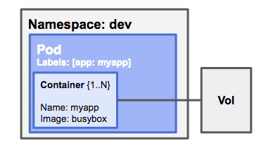

[**Pod**](https://kubernetes.io/docs/concepts/workloads/pods/pod/) is the smallest concept we have in Kubernetes and it is not represented by a single container. Pods consist of one or more containers.

You can think of a [**Namespace**](https://kubernetes.io/docs/concepts/overview/working-with-objects/namespaces/) as a virtual cluster inside of your Kubernetes deployment. You can have multiple namespaces inside of a single Kubernetes cluster and each one of them is isolated from each other. As all pods run in a specifc namespace, they can help your team with the organisation, security and performance of your pods.

A [**Label**](https://kubernetes.io/docs/concepts/overview/working-with-objects/labels/) is a key/value pair that is used to provide attributes to objects. It's good practice to leverage labels, as you'll be able to have a more granular control over what your pods are doing. Labels can be used to query specific objects.

A **Volume** serves data to the pod.

> **NOTE:** Don’t use naked Pods (that is, Pods not bound to a ReplicaSet or Deployment) if you can avoid it. Naked Pods will not be rescheduled in the event of a node failure. For further information, refer to the Kubernetes [Best Practices](https://kubernetes.io/docs/concepts/configuration/overview/#naked-pods-vs-replicasets-deployments-and-jobs) documentation.
